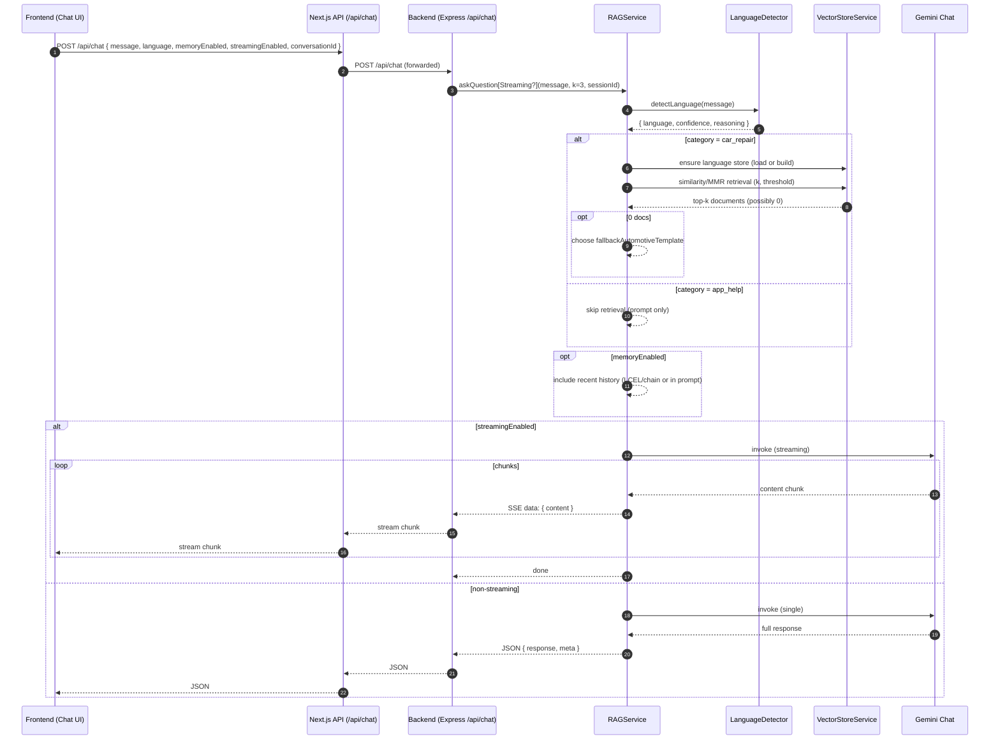
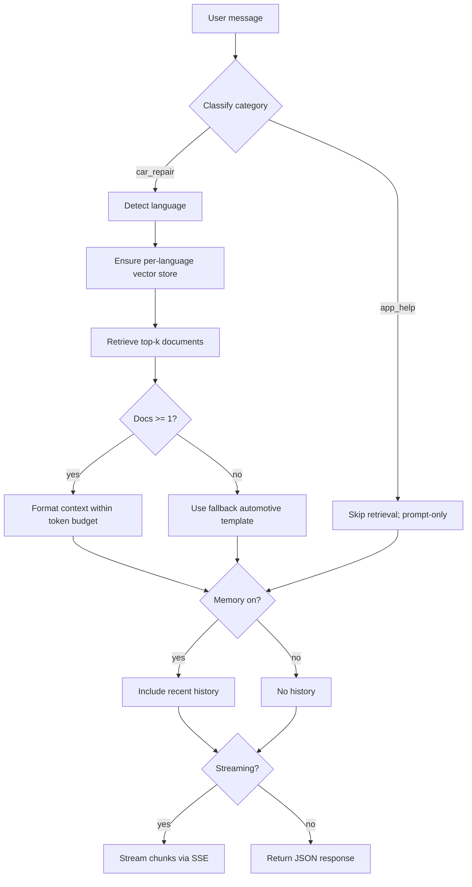

# System Flow

This document shows how the project works end‑to‑end for both backend and frontend developers.

Updated: 2025-10-25

---

## 1) High-level sequence



[chart](https://mermaid.live/view#pako:eNp1VGtv2jAU_SuWPzEpbdMgKERqpz7Y1InulbYfNqbJJLfgxbE922FliP--64SkaVk_EPw49557jq-9oanKgMbUwu8SZApXnC0MK2aSEFY6JctiDsbPNDOOp1wz6cjdNWGWvDNKOpAZ6V0umV988xJ3_rkCfoRHd_jLVtPeEdP8KMWAPfTFxIMvWJpXSSeP2oC15PWAr-fvfQT-JWBWPIWXgKvJrQdMmVyUbAFX4CB1ak_OfeJR99Vegj94Jd10euOB76HgkhMveiY95u764OwMxcXk86fk9qlgsiEFKkDmgIhdDQEuFcqsJ5LNBWQBsc4Aw4SLdiVVcgXGMseVvM7I1lNgduS4mOxR9B6U-cNMBlllz8UEYWhIjIXmX0qwPsn3pOF4-6PXVpSf9pEdZxVNFY2BGI6uxSSrvGqca6IqFO4fNCybjjCs-4FnvokCgnxWSWSsy2fCkZQ5WKBycopD89OAZrw6iob3PokJSFsaaJOiO3gcpCcUy4gyZF5yUZfaDbK84IIZ7tZHNzdfkdsZDismSC8PiFtiFy1VG3aftMU7pQ9ykqm0LEA6S3paoRtzsSbhDqy0I6FH2Hpeszbx6VIpC-SBCTHHrj3H-1Iox1dwC4UWKLcOwm72AxCI7ZjAtP65BKGf1DR5bc51V4U2qsBClBTrqq5dQl_cs2baz8RlKsoMMFmKCsmSez_XpDe9nEx9_3DpXcVvTdHN7o_sZW92jcfL4POvVI7n0wJ3vgmlNNpTyrw1DvFPxlUPh6sRL5z1PZ4kE5Ixx3x_Ndhtg8MWb65bTfs8jb8puH_33-2dtmdkmZLQno9U8qAV87pc3BSw09oV9lAKgWZbraSFPaYPyaePqKjZ90-BY42wjiyPqxc7YprFSgIN6MLwjMbOlBDQAkzB_JRuPGRG3RIKmNEYhxkz-YzO5BZj8BX7plTRhBlVLpY0xv7FYmip0fLm_W8hSAfmUpXS0fg4qlLQeEMfcXY4jsbj_jAcjgbRMBpEo4CuaRyNDsNo0B8PTsYn_WEUHg-3Af1bsYaHo9HgeDDoR_1hPzwOw5PtP_C_F8I)

---

## 2) Branching and filtering



## [chart](https://mermaid.live/view#pako:eNpVUV1v2jAU_StXfgZEEj5KpnVa-WihhUpje1lAlZtckiiJbdkOLYv477OdlbIX6_qec889Pm5IzBMkITmU_C3OqNTwc7ZjAN-jXwolVKgUTXEP3e4t3DXTkiqVH04QU40pl6ez5d4Z1HTki0RBc-m402iGGmMNJWVpbSUsc-qwWTRnqpYIAmX3A4ejYXMJyhwteebI8-gHapnjEUFz0S0g4XFdIdPKkeaOtGhmPFZw-xW8b87Swlo6oXLofbTgsqIaYs40vmt4y3WWM6NXIIPXOklR7y9TjLuhBxsAHGhZvtK4AFprXnGdWxtYidK8f395OxXiJcNSuMFltC1yAbJ1TcsvICSvhO5yVp7czL3jrZo1ViZC4Kz1_NC2bbn8LFfXL3mMliwu6wSNfGwygCy3ebWyqyv3T9GG_wc-uva62WqJtMpZ2u58atu2XF8v2kQtEeKsZoWCY05hu53vL8R_e57t79SSwWr7vDGmlOBM4Z50SCrzhIRa1tghFZr47ZU0VmBHdIYV7khoyoTKYkd27GxmBGW_Oa8-xiSv04yE5g-UudUiMaHPcppK-klBlqCc8pppEg6dAgkb8k5Cf9QbB31_PLzxRwNvcjMKOuREwm4w6fcGYwsMR8O-503OHfLHLfV6o2Aw8b3A84PA94ZBcP4LlZn6dg)

## 3) Backend request handling (Express)

1. Rate limit + user tier checks
2. Cache lookup by `message+language+memoryEnabled`
3. Configure RAG toggles: memory/streaming per request
4. Choose sessionId = conversationId or IP (isolates memory)
5. Streaming path: open SSE and forward chunks from RAG
6. Non-streaming path: call RAG once, optimize response length, estimate cost, cache JSON

Relevant file: `backend/server.js`

---

## 4) Frontend streaming loop (SSE)

- POST to `/api/chat` (Next route) with `streamingEnabled=true`
- The backend emits `data: {"content":"..."}` lines
- Append chunks to the assistant message until `done`

Pseudo-code:

```ts
const res = await fetch("/api/chat", {
  method: "POST",
  body: JSON.stringify({ message, streamingEnabled: true }),
});
const reader = res.body!.getReader();
const dec = new TextDecoder();
let full = "";
while (true) {
  const { done, value } = await reader.read();
  if (done) break;
  for (const line of dec.decode(value).split("\n")) {
    if (line.startsWith("data: ")) {
      const evt = JSON.parse(line.slice(6));
      if (evt.content) full += evt.content; // append to UI
    }
  }
}
```

Relevant files: `frontend/app/api/chat/route.ts`, `frontend/components/ChatInterface.tsx`

---

## 5) Log markers by stage

- [SANITIZE] input cleanup and truncation info
- [RETRIEVAL] strategy, k, fetched, threshold, time_ms, streaming
- [LLM] estimated tokens, model, time_ms, streaming
- [CACHE] embedding cache activity (hits/misses)
- [FALLBACK] reason=no_docs when retrieval yields 0 documents

---

## 6) Data & stores (where context comes from)

- Per-language CSVs in `dataset/` → loaded via `DataLoaderService`
- MemoryVectorStore persisted to JSON under `dataset/vector_store_*.json`
- Embedding cache file (JSON) under `dataset/embedding_cache.json` (overridable via `EMBEDDING_CACHE_PATH`)

---

## 7) One‑screen ASCII flow (for quick orientation)

```
[Frontend Chat]
  |  POST /api/chat (message, lang?, memory?, streaming?)
  v
[Next.js API]
  |  forwards request
  v
[Express Backend]
  |  rate-limit & tier checks -> cache lookup
  |  configure RAG (memory/streaming) + sessionId
  v
[RAGService]
  |  classify -> language detection
  |  if car_repair: ensure store -> retrieve -> filter by threshold
  |    if 0 docs -> fallback prompt
  |  format context (token budget)
  |  include recent history if memory
  |  streaming? yes: stream chunks | no: single invoke
  v
[Gemini Chat]
  |  returns chunks or full response
  v
[Express Backend]
  |  SSE back to client OR JSON
  v
[Frontend Chat]
  |  append chunks or set final answer
```

---

For deeper details, see `docs/DEVELOPER_GUIDE.md` and `docs/FUNCTION_REFERENCE.md`.
